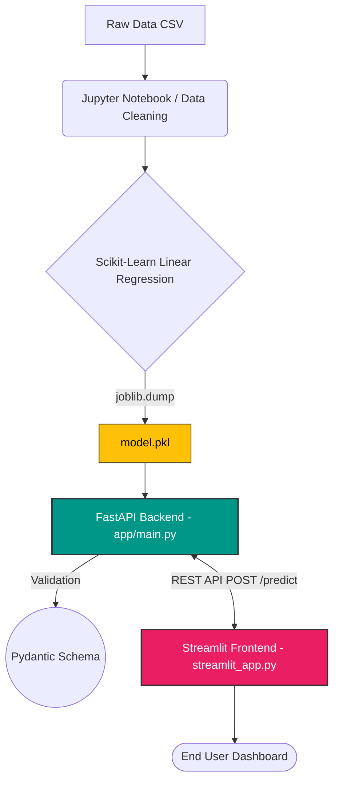

# House Price Prediction Microservices


A full-stack, production-ready Machine Learning application predicting house prices based on physical attributes. This repository implements a robust microservices architecture demonstrating best practices for serving models locally and in the cloud.

---

## Live Demo

**[Live Streamlit App](https://house-price-valuation.streamlit.app/)** *(Link coming soon in cloud deployment phase)*

---

## Project Architecture

This application consists of three decoupled components:

1. **Machine Learning Model (Scikit-Learn):** A classic Linear Regression algorithm trained locally via Jupyter Notebook (`research/LR_pred_sale-price.ipynb`). The finalized model is cleanly packaged via `joblib` into `app/model.pkl`.
2. **FastAPI Backend (`app/main.py`):** An asynchronous, robust REST API that validates incoming arrays seamlessly via `Pydantic` models and transforms JSON objects into predictable Pandas dataframes.
3. **Streamlit Frontend (`streamlit_app.py`):** An interactive UI separating UI complexity from data science. It abstracts the many possible features down to the crucial top 8, supplying defaults on the rest, and connects smoothly to the FastAPI endpoint.

### System Architecture Workflow



---

## Installation & Local Run

### Prerequisites
- Python 3.9+ 
- Virtual Environment tool (`venv` or `conda`)
- Optionally: Docker installed

### Setup Environment

1. **Clone the repo and navigate to directory:**
   ```bash
   git clone <your-repo-link>
   cd house-price-linear-regression
   ```

2. **Set up virtual environment & install requirements:**
   ```bash
   python -m venv venv
   # Windows:
   .\venv\Scripts\activate 
   # Mac/Linux:
   source venv/bin/activate
   
   pip install -r requirements.txt
   ```

### Running the Services

To see the system in action, you need **two terminal windows**:

**Terminal 1: Start the FastAPI Backend**
```bash
uvicorn app.main:app --reload
```
*The API will be live at `http://localhost:8000` (Access Interactive Docs at `http://localhost:8000/docs`).*

**Terminal 2: Launch the Streamlit Frontend**
```bash
streamlit run streamlit_app.py
```
*A browser tab will automatically open at `http://localhost:8501` featuring the interactive predicting interface.*

---

## Docker Deployment

To spin this up as a containerized FastAPI backend (No Streamlit UI yet but completely functional API):

```bash
docker build -t house-price-api .
docker run -d -p 8000:8000 house-price-api
```

---

## License

**All Rights Reserved**

The code is available for viewing and running the live demo for portfolio evaluation purposes only. No permission is granted to copy, distribute, modify, or use this code for any personal or commercial purposes without explicit written consent.